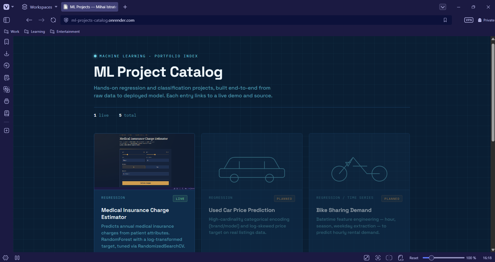

# ML Projects Catalog

A single page listing every ML project in this portfolio, rendered from
`data/projects.json`. Add a new project by editing that file — no HTML
changes needed.

**Live demo:** [ML Projects Catalog](https://ml-projects-catalog.onrender.com)



## Run locally

```bash
python -m venv .venv
source .venv/bin/activate
pip install -r requirements.txt
uvicorn app:app --reload --port 8000
```

Open `http://127.0.0.1:8000/`.

## Add a project

Edit `data/projects.json`:

```json
{
  "title": "Project Name",
  "tagline": "Regression",
  "description": "One or two sentences on what it does and what's interesting technically.",
  "tags": ["scikit-learn", "FastAPI"],
  "status": "live",
  "url": "https://your-deployed-url.onrender.com",
  "repo": "https://github.com/you/repo-name",
  "metric": "Test RMSE $X"
}
```

`status` is `"live"` or `"planned"` — planned cards render dimmed with no
links, so you can list roadmap items without broken URLs.

## Structure

```
ml-gateway/
├── app.py               # FastAPI — reads projects.json, renders the template
├── data/projects.json    # the only file you edit to add/update a project
├── templates/index.html  # card grid UI
└── requirements.txt
```
